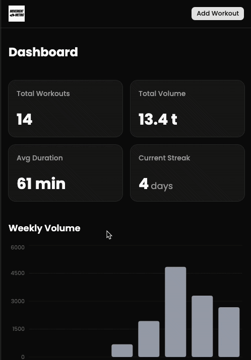

# Movement Metric

A full-stack lifting diary app built as a portfolio project while learning [Claude Code](https://claude.com/product/claude-code) — the AI-powered CLI for software development. Log workouts, track sets and volume, and visualize training progress over time.

   



---

## About This Project

This app started as the capstone demo project for the **[Learn Claude Code](https://www.udemy.com/course/learn-claude-code/) Udemy course** — a hands-on course that teaches developers how to use Claude Code to build real-world full-stack applications faster and more effectively — and was then extended with additional features beyond the original course scope.

The project deliberately follows strict, documented coding standards (see `/docs`) to demonstrate how well-defined conventions allow Claude Code to generate consistent, production-quality code across an entire codebase.

---

## App Features

**Workout Logging**
- Create workouts with name, date, start and finish time
- Add exercises from a pre-populated exercise library
- Log sets with reps and weight per exercise
- Edit or delete any workout and its data

**Dashboard Analytics**
- Stat cards: total workouts, total volume lifted, average duration, current streak
- Weekly volume bar chart (last 8 weeks)
- Monthly workout frequency line chart (last 12 months)
- Recent workouts accordion with per-exercise set breakdown
- Filter workouts by date via calendar picker

**Authentication**
- Sign in / sign up via Clerk with OAuth support
- All routes protected — data is scoped per user

---

## Tech Stack

| Layer | Technology |
|---|---|
| Framework | Next.js 16 (App Router) |
| Language | TypeScript 5 (strict mode) |
| Styling | Tailwind CSS 4 |
| UI Components | shadcn/ui + Radix UI |
| Charts | Recharts |
| ORM | Drizzle ORM |
| Database | PostgreSQL (Neon Serverless) |
| Auth | Clerk |
| Validation | Zod |

---

## Claude Code Features Demonstrated

This project was built using the following Claude Code capabilities taught in the course:

### CLAUDE.md — Project Instructions
A `CLAUDE.md` file at the root defines project-wide instructions that Claude Code reads before every task. This enforces consistent patterns across all generated code without repeating yourself.

### `/docs` Standards Directory
Dedicated documentation files define non-negotiable coding standards for each layer of the stack. Claude Code is instructed to read the relevant doc before generating any code:
- `docs/ui.md` — ShadCN-only components, date formatting rules
- `docs/data-fetching.md` — Server-components-only data fetching, Drizzle ORM patterns
- `docs/data-mutations.md` — Server actions, Zod validation, no-FormData rule, client-side redirects
- `docs/auth.md` — Clerk integration and user data isolation requirements
- `docs/routing.md` — App Router file conventions

### Custom Skills (`/skill`)
The project ships with a custom Claude Code skill (`workout-chart`) that queries the Neon database and generates a monthly workout frequency PNG chart — demonstrating how to extend Claude Code with project-specific slash commands.

### Memory System
Claude Code's persistent memory was used throughout development to remember user preferences, project context, and feedback across sessions — eliminating repetitive re-explanation.

### Neon MCP Integration
The [Neon MCP server](https://neon.tech/docs/ai/mcp) is wired up, allowing Claude Code to inspect the live database schema, run queries, and reason about the data layer directly from the CLI.

### Playwright MCP Integration
The Playwright MCP server gives Claude Code a browser — used for visual inspection, debugging UI issues, and verifying rendered output without leaving the terminal.

### Hooks
Claude Code hooks automate repetitive tasks triggered by specific events (e.g., auto-syncing the docs index in `CLAUDE.md` whenever a new file is added to `/docs`).

---

## Getting Started

1. Clone the repo and install dependencies:

```bash
npm install
```

2. Set up environment variables (`.env.local`):

```bash
# Clerk
NEXT_PUBLIC_CLERK_PUBLISHABLE_KEY=
CLERK_SECRET_KEY=

# Neon PostgreSQL
DATABASE_URL=
```

3. Push the database schema:

```bash
npx drizzle-kit push
```

4. Run the development server:

```bash
npm run dev
```

Open [http://localhost:3000](http://localhost:3000) to view the app.

---

## Course

Built as part of: **[Learn Claude Code — Udemy](https://www.udemy.com/course/learn-claude-code/)**
